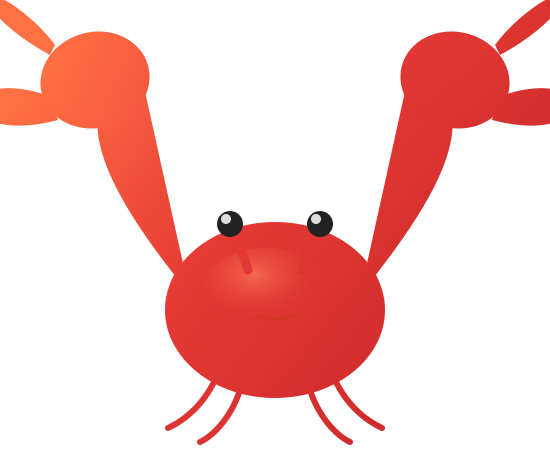

<p align="center">
  
</p>

<h1 align="center">U-ClawX · U-ClawX Portable（U-ClawX 便携版）</h1>

<p align="center">
  <strong>解压即用的 OpenClaw 图形界面 AI 助手 —— 拷进 U 盘，插哪用哪</strong><br>
  <sub>Portable OpenClaw GUI assistant for Windows: zero install, zero dependencies, USB-ready.</sub>
</p>

<p align="center">
  <a href="#-quick-start--快速开始">Quick Start</a> •
  <a href="#-features--功能特性">Features</a> •
  <a href="#-why-u-claw--为什么选-u-claw">Why U-ClawX</a> •
  <a href="#-device-wallet--设备钱包">Device Wallet</a> •
  <a href="#-documentation--文档">Docs</a>
</p>

<p align="center">
  
  
  
  
  
  <a href="https://github.com/dongsheng123132/u-clawx-portable/stargazers">
    
  </a>
</p>

<p align="center">
  English | <a href="README.zh-CN.md">简体中文</a> | <a href="README.ja-JP.md">日本語</a> | <a href="README.ru-RU.md">Русский</a>
</p>

---

**U-ClawX** is a portable (green/portable software) build of [U-ClawX](https://github.com/ValueCell-ai/ClawX) — the desktop GUI for the [OpenClaw](https://github.com/OpenClaw) AI agent runtime. Copy it to a USB drive, plug it into any Windows PC, and run. No installer, no Node.js, no admin rights, nothing written to the host system.

> 中文用户请直接看 [README.zh-CN.md](README.zh-CN.md)，内容更全。

## ✨ Highlights

- 🔌 **True portability** — runs entirely from the USB drive; wallet & config live in `data/clawx-state` on the drive, disposable caches go to the host machine to spare your USB from random writes
- 🖥️ **Full GUI for OpenClaw** — chat, agents, channels (WeChat/DingTalk/Feishu/QQ/Telegram), cron jobs, skills — no terminal required
- 💰 **Built-in device wallet + one-click top-up** — keys are issued by Xiapan Cloud; recharge opens a pre-authenticated payment page; balance errors in chat offer a direct "Top up" button
- 🖼️ **Image generation out of the box** — wired to a default image model, ready on first launch
- 🔄 **Tracks upstream U-ClawX** — rebuilt from the latest stable upstream release so you keep official improvements
- 🌍 **UI in EN / 简体中文 / 日本語 / Русский**

## 📦 Quick Start / 快速开始

1. Download `U-ClawX-portable.zip` from [Releases](../../releases)
2. Unzip **onto your USB drive** (or any folder)
3. Double-click `U-ClawX.exe`
4. On first run the device wallet is provisioned automatically — sign in to the cloud panel to top up

Requirements: Windows 10+ (x64). No installation, no admin rights, no runtime downloads.

## 🧩 Features / 功能特性

| Area | What you get |
|---|---|
| 💬 Chat | Multi-session, streaming Markdown, KaTeX, tables, `@agent` routing, inline `/skill` cards |
| 🤖 Agents | Visual agent management with per-agent model overrides |
| 📡 Channels | WeChat (official plugin), DingTalk, Feishu/Lark, QQ bot, Telegram |
| ⏰ Cron | Recurring or one-time scheduled tasks, results delivered to channels |
| 🧩 Skills | Local-first skill management + document processing (`pdf`/`xlsx`/`docx`/`pptx`) |
| 🔐 Providers | API-key & OAuth providers stored in the OS keychain |
| 💰 Wallet | Server-issued device key, one-click recharge, legacy wallet import |
| 🖼️ Images | Default image-generation model prewired |

## ❓ Why U-ClawX / 为什么选 U-ClawX

The upstream U-ClawX installer targets a single PC. U-ClawX answers a different question: **"Can my AI assistant live in my pocket?"**

- **Zero footprint** — unplug the drive and the host PC keeps nothing but disposable cache
- **Zero setup** — wallet, gateway, and provider wiring are automatic on first launch
- **Fast enough for USB** — startup splash + local compile cache + gateway warmup keep cold starts acceptable even on spinning drives

## 🔑 Device Wallet / 设备钱包

Your API key is generated server-side and bound to this copy of U-ClawX — not to your hardware fingerprint. Key semantics (sharing across copies, rotation, importing an older paid wallet) are documented in [docs/device-wallet.md](docs/device-wallet.md).

## 📚 Documentation / 文档

- [Features](docs/en-US/features.md) · [中文功能说明](docs/zh-CN/features.md)
- [Architecture](docs/en-US/architecture.md)
- [Development guide](docs/en-US/development.md)
- [Proxy settings](docs/en-US/proxy-settings.md)
- [Device wallet](docs/device-wallet.md)

## 🛠️ Build from source

```bash
pnpm run init                 # deps + bundled runtimes
pnpm package:win:portable     # → release/win-unpacked (Windows portable tree)
```

Node.js 22.22.3+/24 LTS and pnpm 9+. See [docs/en-US/development.md](docs/en-US/development.md) for the full command list.

## 🙏 Acknowledgments

Built on the shoulders of [OpenClaw](https://github.com/OpenClaw), [U-ClawX](https://github.com/ValueCell-ai/ClawX), [Electron](https://www.electronjs.org/), and [React](https://react.dev/).

## License

[MIT](LICENSE)

---

<p align="center">
  <sub>虾盘 U-ClawX · Plug-and-play AI, in your pocket.</sub>
</p>
